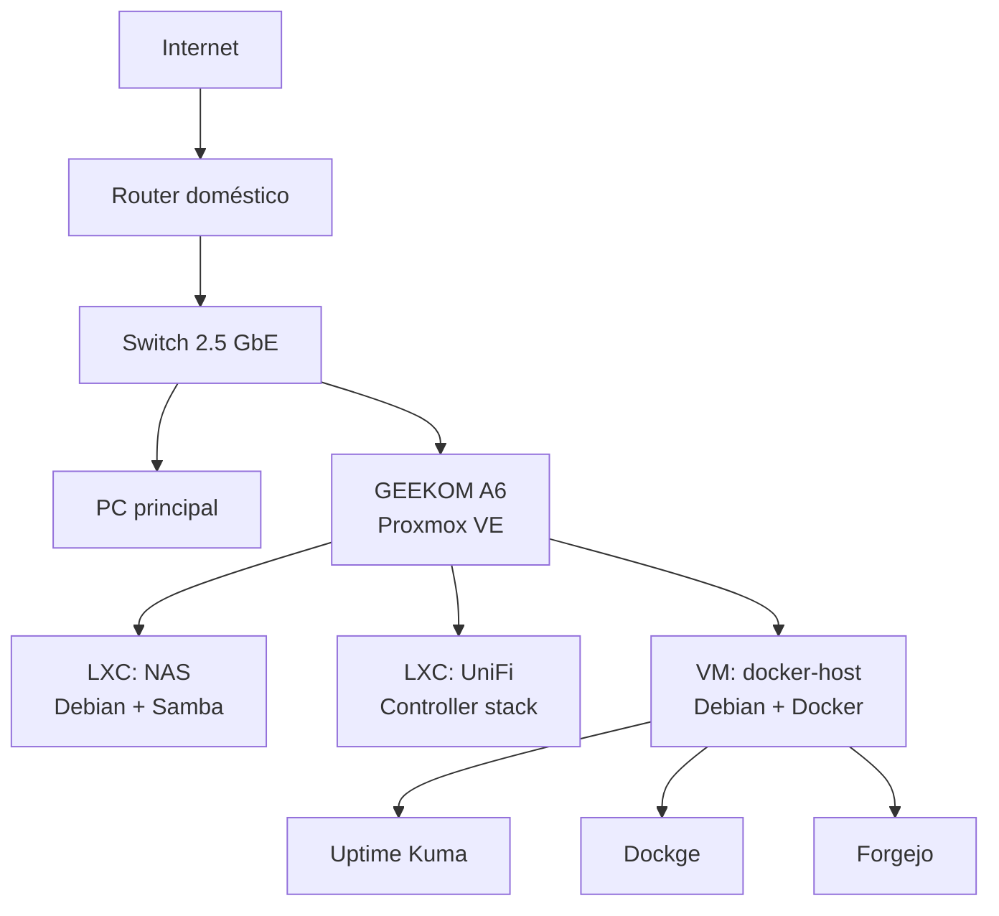

<p align="center">
  <a href="./README.md">🇬🇧 English</a> · <strong>🇪🇸 Español</strong>
</p>

<h1 align="center">HomeLab</h1>

<p align="center">
  Laboratorio de infraestructura self-hosted basado en <strong>Proxmox VE, Debian, Docker, almacenamiento, red y monitorización</strong>.
</p>

<p align="center">
  Diseñado para ser reproducible, comprensible y seguro de publicar.
</p>

---

## Descripción

Este repositorio documenta la arquitectura y la configuración reutilizable de mi HomeLab personal.

El objetivo no es copiar el sistema de archivos del servidor a GitHub. Aquí se conservan las partes útiles para entender, reconstruir y evolucionar la plataforma: arquitectura, distribución de servicios, patrones de despliegue, decisiones de red, almacenamiento y notas operativas.

> **Estado:** desarrollo activo. La virtualización base, acceso NAS, servicios Docker, monitorización y Git self-hosted están operativos.

## Arquitectura



Hay una vista más detallada en [docs/architecture.md](./docs/architecture.md).

## Stack actual

| Capa | Rol actual |
| --- | --- |
| Hypervisor | Proxmox VE |
| Hardware host | GEEKOM A6 |
| SO de guests | Debian |
| Contenedores | Proxmox LXC |
| Runtime de aplicaciones | Docker + Docker Compose |
| Almacenamiento | NAS basado en Samba, simple y preparado para migrar |
| Monitorización | Uptime Kuma |
| Gestión de contenedores | Dockge |
| Git self-hosted | Forgejo |
| Gestión de red | UniFi |
| Acceso remoto | Planificado / en evolución |

## Estructura del repositorio

```text
homelab/
├── docs/
│   ├── architecture.md
│   ├── network.md
│   ├── storage.md
│   └── roadmap.md
├── proxmox/
├── docker/
│   ├── uptime-kuma/
│   ├── dockge/
│   └── forgejo/
├── nas/
├── networking/
├── monitoring/
├── .gitignore
├── README.md
└── README.es.md
```

## Principios

- **Documentar decisiones, no secretos.**
- Priorizar configuración reproducible frente a capturas.
- Mantener datos de servicios y backups fuera de Git.
- Usar placeholders para direcciones y credenciales específicas.
- Separar roles de infraestructura para poder evolucionarlos independientemente.
- Validar cambios antes de convertirlos en baseline documentado.

## Seguridad y privacidad

Este repositorio público excluye deliberadamente:

- contraseñas, tokens y API keys;
- claves SSH privadas;
- direccionamiento privado exacto cuando no sea necesario;
- backups y bases de datos de servicios;
- estado generado en runtime;
- datos personales del NAS;
- exports de configuración que incluyan credenciales.

Los ejemplos deben usar valores saneados o placeholders.

## Para qué sirve este repositorio

Sirve como referencia de reconstrucción, documentación de infraestructura, repositorio de configuraciones reutilizables y registro de decisiones arquitectónicas, además de mostrar el HomeLab como proyecto de ingeniería.

## Roadmap

El trabajo actual y futuro está recogido en [docs/roadmap.md](./docs/roadmap.md).

## Licencia

Todavía no se ha seleccionado una licencia. Hasta que se añada una, se aplican las reglas de copyright por defecto.
