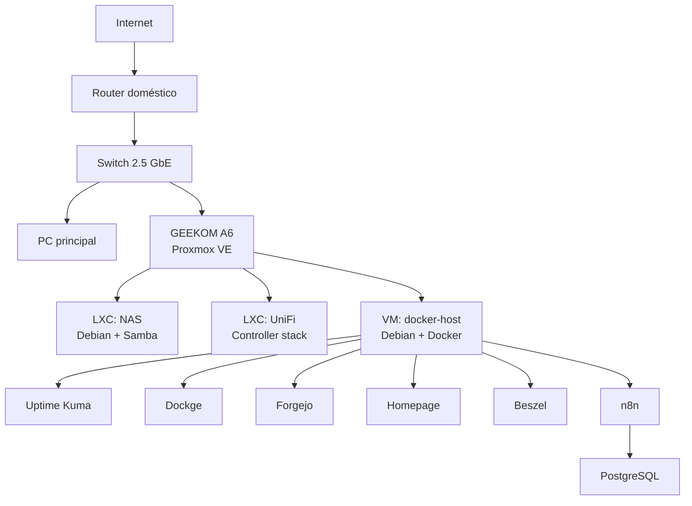

<p align="center">
  <a href="./README.md">🇬🇧 English</a> · <strong>🇪🇸 Español</strong>
</p>

<h1 align="center">HomeLab</h1>

<p align="center">
  Laboratorio de infraestructura self-hosted basado en <strong>Proxmox VE, Debian, Docker, almacenamiento, red y monitorización</strong>.
</p>

<p align="center">
  Diseñado para ser reproducible, comprensible y seguro de publicar.
</p>

---

## Descripción

Este repositorio documenta la arquitectura y la configuración reutilizable de mi HomeLab personal.

El objetivo no es copiar el sistema de archivos del servidor a GitHub. Aquí se conservan las partes útiles para entender, reconstruir y evolucionar la plataforma: arquitectura, distribución de servicios, patrones de despliegue, decisiones de red, almacenamiento y notas operativas.

> **Estado:** desarrollo activo. La virtualización base, acceso NAS, servicios Docker, monitorización y Git self-hosted están operativos. Los Compose saneados del stack Docker actual ya son públicos.

## Arquitectura



Hay una vista más detallada en [docs/architecture.md](./docs/architecture.md).

## Stack actual

| Capa | Rol actual |
| --- | --- |
| Hypervisor | Proxmox VE |
| Hardware host | GEEKOM A6 |
| SO de guests | Debian |
| Contenedores | Proxmox LXC |
| Runtime de aplicaciones | Docker + Docker Compose |
| Almacenamiento | NAS basado en Samba, simple y preparado para migrar |
| Monitorización de disponibilidad | Uptime Kuma |
| Monitorización host/contenedores | Beszel |
| Gestión de contenedores | Dockge |
| Dashboard | Homepage |
| Git self-hosted | Forgejo |
| Automatización | n8n + PostgreSQL |
| Gestión de red | UniFi |
| Acceso remoto | Planificado / en evolución |

## AI Agent Stack

H09 añade una capa local de agentes de IA alrededor de Hermes y OpenCode. **H09 Executor V0.1 ya está operativo** con routing determinista, verificación del repositorio, protección de archivos, auditoría persistente, rollback y escalado automático local-fast → local-heavy. Su primera tarea real de producción también se ha completado correctamente sobre CAD-AI mediante Hermes → H09 → OpenCode → local-fast → verifier. Se publica además un benchmark de programación congelado con las configuraciones exactas probadas, resultados oficiales, prueba de deployment y análisis forense de fallos.

Roles actuales respaldados por evidencia:

- **local-fast:** Qwen3.5-9B Q6_K
- **local-heavy:** Qwen3.6-35B-A3B UD-Q4_K_M
- **cloud:** escalado para tareas no resueltas o sensibles a políticas

Consulta [ai-agent-stack/](./ai-agent-stack/), [H09 Executor V0.1](./ai-agent-stack/executor-v0.1.md) y el [benchmark local de programación del 2026-09-20](./ai-agent-stack/benchmarks/2026-09-20-local-coding/).

## Despliegues Docker reproducibles

Hay definiciones públicas y saneadas para:

- [Uptime Kuma](./docker/uptime-kuma/)
- [Dockge](./docker/dockge/)
- [Forgejo](./docker/forgejo/)
- [Homepage](./docker/homepage/)
- [Beszel](./docker/beszel/)
- [n8n](./docker/n8n/)

Cada carpeta contiene la receta Compose y, cuando hace falta, plantillas seguras de variables de entorno. Las bases de datos, credenciales, tokens y datos reales de los servicios permanecen fuera de Git.

## Estructura del repositorio

```text
homelab/
├── docs/
├── ai-agent-stack/
├── proxmox/
├── docker/
│   ├── uptime-kuma/
│   ├── dockge/
│   ├── forgejo/
│   ├── homepage/
│   ├── beszel/
│   └── n8n/
├── nas/
├── networking/
├── monitoring/
├── .gitattributes
├── .gitignore
├── README.md
└── README.es.md
```

## Principios

- **Documentar decisiones, no secretos.**
- Priorizar configuración reproducible frente a capturas.
- Mantener datos de servicios y backups fuera de Git.
- Usar placeholders para direcciones y credenciales específicas.
- Separar roles de infraestructura para poder evolucionarlos independientemente.
- Validar cambios antes de convertirlos en baseline documentado.

## Seguridad y privacidad

Este repositorio público excluye deliberadamente contraseñas, tokens, API keys, claves SSH privadas, ficheros de entorno reales, bases de datos, backups, datos personales del NAS y exports específicos de máquina que contengan credenciales.

Los ejemplos usan valores saneados o placeholders.

## Roadmap

El trabajo actual y futuro está recogido en [docs/roadmap.md](./docs/roadmap.md).

## Licencia

Todavía no se ha seleccionado una licencia. Hasta que se añada una, se aplican las reglas de copyright por defecto.

## Actualización de H09 — 2026-09-23

H09 ha avanzado significativamente desde la validación inicial de Executor V0.1.

Las nuevas capacidades validadas incluyen:

- fencing de intentos mediante tokens, leases y rechazo de intentos obsoletos;
- lifecycle físico fast → heavy → fast de los modelos locales;
- ejecución consciente del progreso con continuación de la misma sesión;
- `ExecutionEvidence` determinista y persistente;
- `ExecutionAdapter` endurecido con control de scope y persistencia de evidencia;
- composición end-to-end `ExecutionBridge → ExecutionAdapter → VerificationBridge`;
- integración determinista de `H09AutoRunner` con el boundary real `h09-code → h09-auto`.

Hitos actuales:

- **HLC-001D** — evidencia determinista de ejecución: validado;
- **HLC-001E** — adapter y almacenamiento de evidencia endurecido: validado;
- **HLC-001F** — composición del pipeline de ejecución/verificación: validado;
- **HLC-001G** — boundary determinista del runner real: validado.

HLC-001G queda ahora validado mediante una ejecución real con modelo local a través de:

`ExecutionBridge → ExecutionAdapter → H09AutoRunner → h09-code → h09-auto → OpenCode → Qwen3.5-9B → ExecutionEvidence → VERIFYING`.

La tarea real modificó exactamente un archivo autorizado, mantuvo intacto el HEAD de Git, no creó ningún commit del agente, persistió `ExecutionEvidence` con `scope_violation=false` y superó correctamente el postflight. La ejecución permaneció en `local-fast`; no fue necesario escalar al modelo heavy.

La composición determinista posterior de verificación permanece cubierta por HLC-001F.
