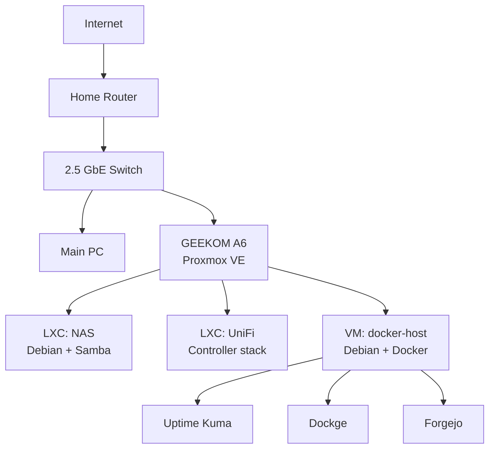

<p align="center">
  <strong>🇬🇧 English</strong> · <a href="./README.es.md">🇪🇸 Español</a>
</p>

<h1 align="center">HomeLab</h1>

<p align="center">
  A self-hosted infrastructure lab built around <strong>Proxmox VE, Debian, Docker, storage, networking and monitoring</strong>.
</p>

<p align="center">
  Designed to be reproducible, understandable and safe to publish.
</p>

---

## Overview

This repository documents the architecture and reusable configuration of my personal HomeLab.

The goal is not to mirror the server filesystem. Instead, it keeps the parts that are useful to understand, rebuild and evolve the platform: architecture, service layout, deployment patterns, networking decisions, storage design and operational notes.

> **Status:** active development. Core virtualization, NAS access, Docker services, monitoring and self-hosted Git are operational.

## Architecture



A more detailed view is available in [docs/architecture.md](./docs/architecture.md).

## Current stack

| Layer | Current role |
| --- | --- |
| Hypervisor | Proxmox VE |
| Host hardware | GEEKOM A6 |
| Guest OS | Debian |
| Containers | Proxmox LXC |
| Application runtime | Docker + Docker Compose |
| Storage | Samba-based NAS, currently simple and migration-friendly |
| Monitoring | Uptime Kuma |
| Container management | Dockge |
| Git hosting | Forgejo |
| Network management | UniFi |
| Remote access | Planned / evolving |

## Repository layout

```text
homelab/
├── docs/
│   ├── architecture.md
│   ├── network.md
│   ├── storage.md
│   └── roadmap.md
├── proxmox/
├── docker/
│   ├── uptime-kuma/
│   ├── dockge/
│   └── forgejo/
├── nas/
├── networking/
├── monitoring/
├── .gitignore
├── README.md
└── README.es.md
```

## Principles

- **Document decisions, not secrets.**
- Prefer reproducible configuration over screenshots.
- Keep service data and backups outside Git.
- Use placeholders for machine-specific addresses and credentials.
- Separate infrastructure roles so they can evolve independently.
- Validate changes before promoting them into the documented baseline.

## Security and privacy

This public repository intentionally excludes:

- passwords, tokens and API keys;
- private SSH keys;
- exact private-network addressing where it is not needed;
- backups and service databases;
- generated runtime state;
- personal NAS data;
- exported configurations containing credentials.

Examples should use placeholders or sanitized values.

## What this repository is for

This repository is useful as:

- a rebuild reference;
- infrastructure documentation;
- a place for reusable Compose files and configuration templates;
- a record of architectural decisions;
- a portfolio view of the HomeLab as an engineering project.

## Roadmap

Current and upcoming work is tracked in [docs/roadmap.md](./docs/roadmap.md).

## License

A license has not been selected yet. Until one is added, the repository remains under default copyright rules.
