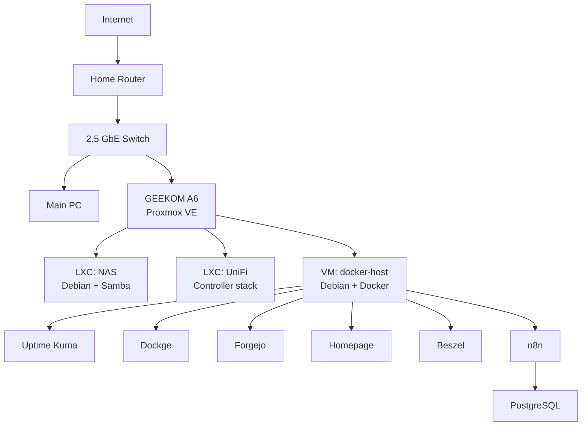

<p align="center">
  <strong>🇬🇧 English</strong> · <a href="./README.es.md">🇪🇸 Español</a>
</p>

<h1 align="center">HomeLab</h1>

<p align="center">
  A self-hosted infrastructure lab built around <strong>Proxmox VE, Debian, Docker, storage, networking and monitoring</strong>.
</p>

<p align="center">
  Designed to be reproducible, understandable and safe to publish.
</p>

---

## Overview

This repository documents the architecture and reusable configuration of my personal HomeLab.

The goal is not to mirror the server filesystem. Instead, it keeps the parts that are useful to understand, rebuild and evolve the platform: architecture, service layout, deployment patterns, networking decisions, storage design and operational notes.

> **Status:** active development. Core virtualization, NAS access, Docker services, monitoring and self-hosted Git are operational. Sanitized Compose definitions for the current Docker stack are public.

## Architecture



A more detailed view is available in [docs/architecture.md](./docs/architecture.md).

## Current stack

| Layer | Current role |
| --- | --- |
| Hypervisor | Proxmox VE |
| Host hardware | GEEKOM A6 |
| Guest OS | Debian |
| Containers | Proxmox LXC |
| Application runtime | Docker + Docker Compose |
| Storage | Samba-based NAS, currently simple and migration-friendly |
| Availability monitoring | Uptime Kuma |
| Host/container monitoring | Beszel |
| Container management | Dockge |
| Dashboard | Homepage |
| Git hosting | Forgejo |
| Workflow automation | n8n + PostgreSQL |
| Network management | UniFi |
| Remote access | Planned / evolving |

## AI Agent Stack

H09 adds a local AI-agent layer around Hermes and OpenCode. **H09 Executor V0.1 is now operational** with deterministic routing, repository verification, protected-file enforcement, persistent audit, rollback and automatic local-fast → local-heavy escalation. Its first real production task has also completed successfully on CAD-AI through Hermes → H09 → OpenCode → local-fast → verifier. A frozen coding benchmark is published with the exact tested configurations, official results, deployment follow-up and failure forensics.

Current evidence-backed roles:

- **local-fast:** Qwen3.5-9B Q6_K
- **local-heavy:** Qwen3.6-35B-A3B UD-Q4_K_M
- **cloud:** escalation path for unresolved or policy-sensitive work

See [ai-agent-stack/](./ai-agent-stack/), [H09 Executor V0.1](./ai-agent-stack/executor-v0.1.md) and the [2026-09-20 local coding benchmark](./ai-agent-stack/benchmarks/2026-09-20-local-coding/).

## Reproducible Docker deployments

Public, sanitized deployment definitions are available for:

- [Uptime Kuma](./docker/uptime-kuma/)
- [Dockge](./docker/dockge/)
- [Forgejo](./docker/forgejo/)
- [Homepage](./docker/homepage/)
- [Beszel](./docker/beszel/)
- [n8n](./docker/n8n/)

Each directory contains the Compose recipe and, when needed, safe environment templates. Runtime databases, credentials, tokens and service data stay outside Git.

## Repository layout

```text
homelab/
├── docs/
├── ai-agent-stack/
├── proxmox/
├── docker/
│   ├── uptime-kuma/
│   ├── dockge/
│   ├── forgejo/
│   ├── homepage/
│   ├── beszel/
│   └── n8n/
├── nas/
├── networking/
├── monitoring/
├── .gitattributes
├── .gitignore
├── README.md
└── README.es.md
```

## Principles

- **Document decisions, not secrets.**
- Prefer reproducible configuration over screenshots.
- Keep service data and backups outside Git.
- Use placeholders for machine-specific addresses and credentials.
- Separate infrastructure roles so they can evolve independently.
- Validate changes before promoting them into the documented baseline.

## Security and privacy

This public repository intentionally excludes passwords, tokens, API keys, private SSH keys, live environment files, application databases, backups, personal NAS data and machine-specific exports containing credentials.

Examples use sanitized values or placeholders.

## Roadmap

Current and upcoming work is tracked in [docs/roadmap.md](./docs/roadmap.md).

## License

A license has not been selected yet. Until one is added, the repository remains under default copyright rules.

## H09 platform update — 2026-09-23

H09 has progressed beyond the initial Executor V0.1 validation.

New validated capabilities include:

- attempt fencing with per-attempt tokens, leases and stale-attempt rejection;
- physical fast → heavy → fast local-model lifecycle management;
- progress-aware execution with same-session continuation;
- durable deterministic `ExecutionEvidence`;
- hardened `ExecutionAdapter` scope enforcement and evidence persistence;
- end-to-end `ExecutionBridge → ExecutionAdapter → VerificationBridge` composition;
- deterministic `H09AutoRunner` integration with the real `h09-code → h09-auto` boundary.

Current workflow milestones:

- **HLC-001D** — deterministic execution evidence: validated;
- **HLC-001E** — execution adapter and hardened evidence storage: validated;
- **HLC-001F** — execution/verification pipeline composition: validated;
- **HLC-001G** — deterministic real-runner boundary: validated.

The remaining HLC-001G gate is a real execution through:

`ExecutionBridge → ExecutionAdapter → H09AutoRunner → h09-code → h09-auto → OpenCode/Qwen → ExecutionEvidence`.

That real-model execution has intentionally not been run yet.
